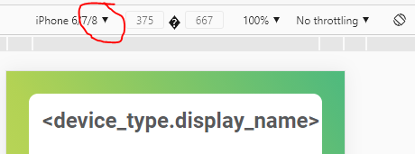

# Twomes Measurement Device Installation Manual Template

The contents of this folder can be used as the template for the manuals with installation instructions for a specific measurement device type. 

## Table of contents
* [Prerequisites](#prerequisites)
* [Writing](#writing)
* [Previewing](#previewing)
* [Deploying](#deploying)

## Prerequisites
To use this template, you only need a web browser and a plain text editor (or your favourite IDE).

## Writing
Clone this repository our just download the contents of this folder. Adapt the content of `index.html` to fit the needs of your measurement device type. Be sure to write in the  language the intended audience of the Twomes app. After scanning its QR-code, the manual of your device type is presented to the user by the Twomes app. The purpose of the installation manual is to help users physically install and power up devices of your specific measurement device type.

Do not change the existing styles in the stylesheet; doing so would ruin consistency with the visual style of installation manuals of other devices. Instead, add additional style rules for any custom styling that you may require. Morerover, do not change the content of the file `preview.html`; its purpose is to mimic the way your `index.html` is displayed by the Twomes app.

The default styles are:
* `div.video-block` with predefined styling for (embedded videos);
* `div.image-block` with predefined styling for images;
* `div.text-block` with predefined styling for texts.

## Previewing
Open the file `preview.html` using a regular web browser to preview your manual as shown in the Twomes app. To make the preview resemble the size and aspect ratio of a smartphone screen:
1. Press the `Ctrl + Shift + I` keys (or `F12` ) on your keyboard to access the Developer Tools.
2. Press the `Ctrl + Shift + M` keys on to enter (mobile) device emulation mode.

By default, your preview is now in 'Responsive' mode. Using the dropdown menu (above the preview), you can also select custom dimensions for specific devices, such as the iPhone 6/7/8.

## Deploying
Upload the contents of the manual folder to the server to make it available in the Twomes app. Be sure to include all files in the `manual` folder of your device: not only the the file `index.html`, but also all resources referred to in this file, like images. You can skip uploading the `README.md` file (this file).

For the WarmteWachter app, files must be uploaded to `https://energietransitiewindesheim.nl/manuals/<device_type.name>/`. 
You cannot upload your manual to that destination yourself. Instead, you should request [@hterhofte](https://github.com/hterhofte) to do this, by creating a pull request and requesting him explicitly to review your pull request and upload your files. After uploading, the Twomes WarmteWachter app can display the installation manual. 

Example: the installation manual for the `Generic-Test` device type is available at: [https://energietransitiewindesheim.nl/manuals/Generic-Test/](https://energietransitiewindesheim.nl/manuals/Generic-Test/)
